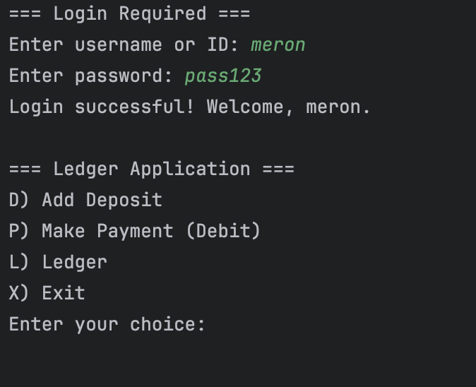
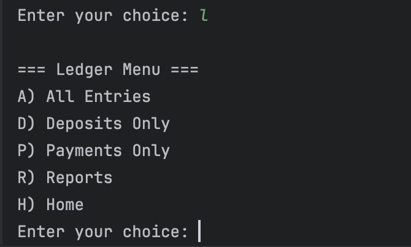
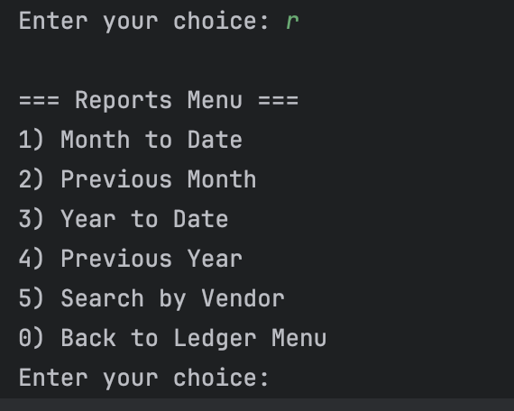

# Ledger Application (Capstone-1)

This is a ** CLI-based financial ledger application** developed in **Java** as part of my Capstone 1 project for Java Foundations.


# Author 
Name: Meron Weldselase 

instructor: David Dykes

Date: 10/17/2025

# It allows users to:
- Record **deposits** and **payments**
- View transaction **history**
- Generate reports by **date**, **vendor**, or **custom filters**
- Save and load data from a **CSV file**


##  Features

-  Add Deposit
-  Make Payment
-  View All Transactions
-  Generate Reports (Month to Date, Previous Month, Year to Date, Previous Year)
-  Search by Vendor or Description
-  Data saved to `transactions.csv` file and automatically loaded at startup
-  Login authentication with username/password and 3 attempts


# How to Run
1. Open the project in **IntelliJ IDEA** (or your preferred IDE)


2. Run the `Main.java` file
3. Login with valid credentials



4. Follow on-screen prompts to:
    - Add deposits/payments
    - View ledger
   
   
    - Search or generate reports
   
5. Exit to save changes to `transactions.csv`

# Interesting Code
This code implements a login system that gives the user 3 attempts to enter the correct username and password. If authentication fails after 3 tries, access is denied and the program exits.

```java

final int MAX_ATTEMPTS = 3;
int attempts = 0;

while (attempts < MAX_ATTEMPTS) {
System.out.print("Enter username or ID: ");
String username = scanner.nextLine().trim();

    System.out.print("Enter password: ");
    String password = scanner.nextLine().trim();

    if (credentials.containsKey(username) && credentials.get(username).equals(password)) {
        System.out.println("Login successful! Welcome, " + username + ".");
        return true;
    } else {
        attempts++;
        int remaining = MAX_ATTEMPTS - attempts;
        System.out.println("Invalid username or password.");
        if (remaining > 0) {
            System.out.println("You have " + remaining + " attempt(s) left.\n");
        }
    }
}

```
